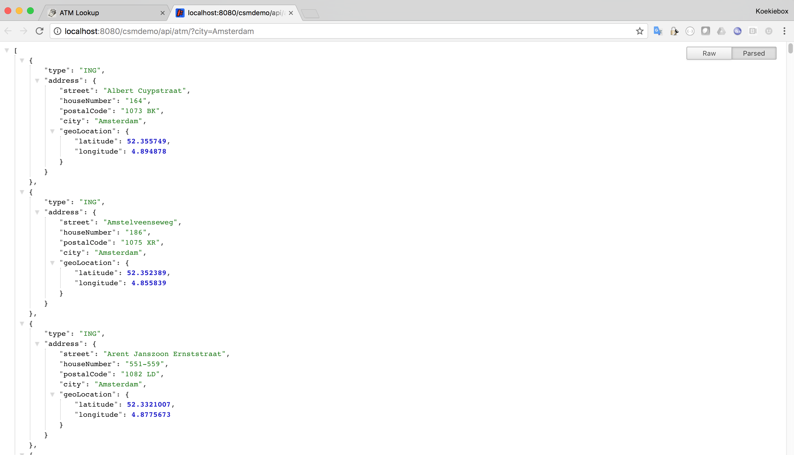

---

---

# Camel Spring Maven Backbase Demo (CSM Demo)

[](https://github.com/koekiebox/CSMDemo/releases)
[](https://github.com/koekiebox/CSMDemo/releases/download/1.0/csmdemo-javadoc.jar)
[](https://github.com/koekiebox/CSMDemo#test-output)

## Introduction

A sample application making use of Maven, Camel and Spring.
The purpose of the application is to lookup ATM's in cities across the Netherlands.

The application provides for an REST API as well as a built-in GUI (using JSF).

The application was develped using **IntelliJ IDEA 2015.2.5**.
  
## Architecture

The diagram below describes the architecture of the application from a high level.


##### 1st Layer _(Top)_ 

* The top layer shows the clients for the CSM Demo application.
A client may be a person, or an external entity consuming the CSM Demo JSON/REST web service.
Although SOAP web services are not currently supported, adding SOAP would be 
a straightforward task _(This includes proprietary protocols also)_.

* This layer showcases external parties _(Outside of the application environment)_ 

##### 2nd Layer

* The following layer is within the CSM Demo application, deployed in a Tomcat 7 environment.
* The application conforms to the J2EE Web specification and is J2EE servlet spec 3.0 compatible.

* JSF (Java Server Faces) was chosen as a user interface framework for the GUI, and 
access to this GUI is controlled via the Spring Security framework (MVC).

* Spring REST controllers are used to expose the REST JSON based API. 

* Supported rest calls include;

|Endpoint                     | Parameter                                                           | HTTP Method | Description                                                               |
|-----------------------------|---------------------------------------------------------------------|-------------|---------------------------------------------------------------------------|
| `/cmsdemo/api/atm/`         | _Mandatory_  `city` - The city to retrieve ATM's for.               | GET         | ATM web service used to retrieve ATM's for a specific city.               |
| `/cmsdemo/api/atm/city`     | `city_alias` - The city alias used as lookup to list valid cities.  | GET         | Lookup web service used to find valid cities based on lookup parameters.  |


> See package `com.backbase.csmdemo.web.rest` for API.
 
> See package `com.backbase.csmdemo.web.backing` for JSF backing bean. 

##### 3rd Layer

* The logic for the application will live in the Application Layer.
  This ensures that we are not duplicating code in the upper _(super)_ layers.

* There will be no direct data access calls made on this layer.   
     
> See package `com.backbase.csmdemo.application`.  

##### 4th Layer

* The layer responsible for retrieving data from various sources. 
The sources may also include external systems. 

> See package `com.backbase.csmdemo.dao`.

##### Other Layers

The **model** contains POJO objects shared between all layers.
> See package `com.backbase.csmdemo.model`.

The **exception** contains `java.lang.Exception` sub-classes used for the CSM Demo application. 
  
> See package `com.backbase.csmdemo.exception`.    

### Comments and Feedback

* The web application and web service does not have SSL/TLS. 
One would need to configure this before the web service is to become live.
* Apache Camel framework was not used.
* The project was implemented to the set of requirements, please see comments in the code 
for why certain decisions were made.
* The model layer is used to share POJO's between layers.
* Please don't judge, `hashCode()` and `toString()` have not been implemented for `ABaseModel`. 
This is purely due to this application being used for demonstration.

### Frameworks Utilised

The following Java technologies and versions are used for the project.

|Framework           | Version         | Description                                          |
|--------------------|-----------------|------------------------------------------------------|
|Java                | 1.8             | The Java version used for compilation and execution. |
|Spring Core         | 4.3.12.RELEASE  | The core Spring.                                     |
|Spring Web          | 4.3.12.RELEASE  | The Spring web for the rest API.                     |
|Spring Web MVC      | 4.3.12.RELEASE  | The MVC for security.                                |
|Spring Security     | 4.2.3.RELEASE   | Used for API and Web page security.                  |
|Jackson Databind    | 2.9.2           | Required by Spring for JSON binding.                 |
|Apache HTTP Core    | 2.9.2           | HTTP Client used for external comms. and testing.    |
|Apache HTTP Client  | 2.9.2           | HTTP Client used for external comms. and testing.    |
|Org.JSON            | 20170516        | For internal JSON parsing _(serialization)_.         |
|JSF                 | 2.2.8           | The Java Server Faces Mojara implementation.         |
|Servlet             | 3.0.1           | The J2EE app server provided implementation.         |
|PrimeFaces          | 6.1             | The JSF implementation framework.                    |
|JUnit               | 4.12            | Used for unit testing.                               |
|Maven               | 3.3.9           | For building and testing.                            |
|Apache Tomcat       | 7.0.82          | Runtime tested.                                      |


## Compiling

Maven is used to perform building, javadoc generation and testing of the CSM Demo.
Please ensure you have downloaded and installed Maven successfully.
Confirm with running the following command `mvn -version`, should produce something similar to;

```
Apache Maven 3.3.9 (bb52d8502b132ec0a5a3f4c09453c07478323dc5; 2015-11-10T20:41:47+04:00)
Maven home: /usr/local/apache-maven-3.3.9
Java version: 1.8.0_101, vendor: Oracle Corporation
Java home: /Library/Java/JavaVirtualMachines/jdk1.8.0_101.jdk/Contents/Home/jre
Default locale: en_US, platform encoding: UTF-8
OS name: "mac os x", version: "10.12.6", arch: "x86_64", family: "mac"
```

Make use of the following commands.

### Maven Compile

`mvn clean compile`

### Maven Install (Runs JUnit TestCases and generates JavaDocs)

*Please see the Unit Testing section first.*

`mvn clean install`  

## Unit Testing

Please consult the [README.md](src/test/README.md) located in the `src/test/` folder.  

## Usage of GUI

The screenshots below describe the using of the ATM Lookup via the Web Front-End.

###### 1. Navigate to the CSM Demo web page (http://localhost:8080/csmdemo/):

> Please ensure the web application is deployed successfully first.

You will be prompted to enter valid username and password. 
See the valid users at the **Users** section.


###### 2. After you successfully logged in, you will be presented with a list of default ATM's.
 

###### 3. Start typing the name of the city you wish to locate ATM's for. Notice the valid list of cities will start populating. 
 

###### 4. Once you select one of the available cities, the ATM's applicable to those cities will be retrieved and displayed. 


###### 5. You may click on the example web service link to see an example of a valid output _(Opens in a new tab / page)_. 


#### Users

The following users and roles exists;

|Username            | Password   | Roles         |
|--------------------|------------|---------------|
|**admin**           | `12345`    | ADMIN, ATM    |
|**johnny**          | `123456`   | ATM           |
|**sally**           | `123456`   | ATM           |

> Additional users may be added by making changes to; 
```
com.backbase.csmdemo.security.SecurityConfig.UserMapping
```

## JavaDocs

The JavaDocs may be accessed here; [JavaDocs](target/apidocs/index.html).

## Test Output

Below is a screenshot of running the test cases with IntelliJ IDEA.


## Release

Please see [ALL RELEASES](https://github.com/koekiebox/CSMDemo/releases) for a list of valid releases.